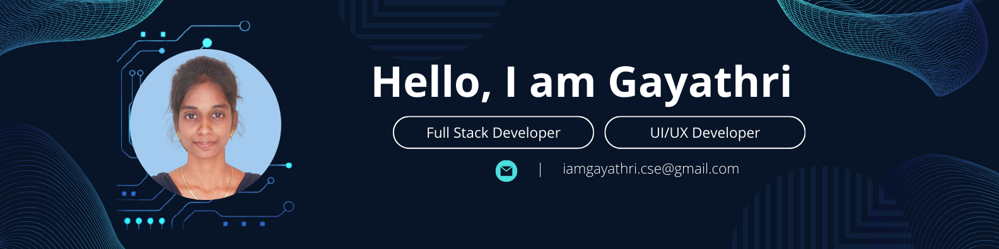

**Full Stack Developer & UI/UX Enthusiast | BE in Computer Science | Passionate Learner**

As a Full Stack Developer and UI/UX Designer with a BE in Computer Science, I am dedicated to crafting seamless user experiences and robust applications. 
My goal is to leverage my skills in both front-end and back-end development to contribute to innovative projects. 
I am passionate about continuous learning and excited to explore new technologies that push the boundaries of what's possible in the tech world.!

🔧 **Technical Skills:**

Web Development

	<table>
		<tr>
			<td><code></code></td>
			<td><code></code></td>
			<td><code></code></td>
			<td><code></code></td>
			<td><code></code></td>
		</tr>
	</table>

Languages

	<table>
		<tr>
			<td><code></code></td>
			<td><code></code></td>
		</tr>
	</table>

UI/UX Design 

	<table>
		<tr>
			<td><code></code></td>
			<td><code></code></td>
		</tr>
	</table>

Framework

	<table>
		<tr>
			<td><code></code></td>
		</tr>
	</table>

Database

	<table>
		<tr>
			<td><code></code></td>
		</tr>
	</table>

Version Control

	<table>
		<tr>
			<td><code></code></td>
			<td><code></code></td>
		</tr>
	</table>

Others 
<code></code>
<code></code>
<code></code>
<code></code>

💡 **What I Bring to the Table:**

Full Stack Expertise: Ability to design, develop, and maintain comprehensive web applications.
UI/UX Focus: Passionate about creating intuitive and aesthetically pleasing user interfaces.
Continuous Learning: Committed to staying updated with the latest trends and technologies in the industry.
Problem-Solving: Adept at tackling complex challenges and finding innovative solutions.

🚀 **Current Interests:**

I am currently diving deep into **Laravel-10**, exploring its capabilities to create robust and scalable web applications. 
Laravel's elegant syntax and powerful tools are enhancing my development workflow and allowing me to build feature-rich applications efficiently.

🌐 **Let's Connect:**

I love collaborating on exciting projects and am always open to new opportunities. 
Feel free to reach out to me on 📧 Email or check out my projects here on GitHub. 
Let's build something amazing together!

